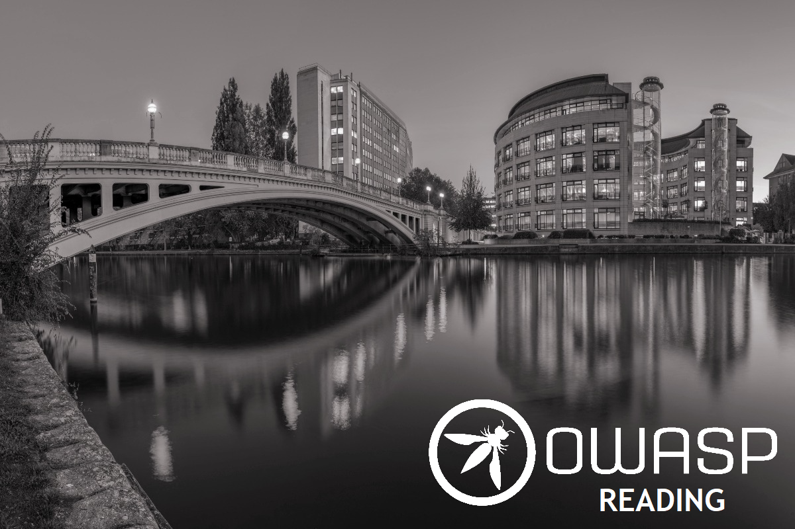

---

layout: col-sidebar
title: OWASP Reading
tags: reading-tag
region: Europe
meetup-group: OWASP-Reading-Chapter
country: United Kingdom
level: 4
postal-code: 

---
  
# Welcome to OWASP Reading Chapter

We welcome you to join our band of App Sec enthusiasts and share your ideas and knowledge to the world!

As you may be aware of, Reading is one of UK's top digital cities and hosts a multitude of IT companies across different disciplines - AI and Data, ECommerce, Cyber, Digital, Gaming, IoT, Medical Technology and FinTech.

How exciting would it be see AppSec through the lenses of all these people and get a chance to interact with them?

So, why wait? [Join us](https://www.meetup.com/OWASP-Reading-Chapter/) today!

[Ramesh Krishnasagar](mailto:ramesh.krishnasagar@owasp.org) and [Shweta Choudhaha](mailto:shweta.choudaha@owasp.org) (chapter leaders) are here to assist you with anything regarding our Reading Chapter. 

## Our channels
* Connect with us on [Facebook](https://www.facebook.com/OWASPReading)
* Tweets on [Twitter](https://twitter.com/owaspreading)
* Videos on [Youtube](https://www.youtube.com/channel/UCitrDIoSVjayy6GrQ2LuzKA)

## Hello speakers!
Would you like to share something interesting on security? We are all ears! 
All we want you to do is to
* Review and agree with the [OWASP Speaker Agreement](https://owasp.org/www-policy/legal/speaker-agreement)
* Send the proposed talk title, abstract and speaker bio to the us via [e-mail](mailto:ramesh.krishnasagar@owasp.org) 

## Meetings
We schedule meetings on [Meetup](https://www.meetup.com/OWASP-Reading-Chapter/) 



## Tickets
Please get your tickets on Eventbrite once an event annoncement is made.  
